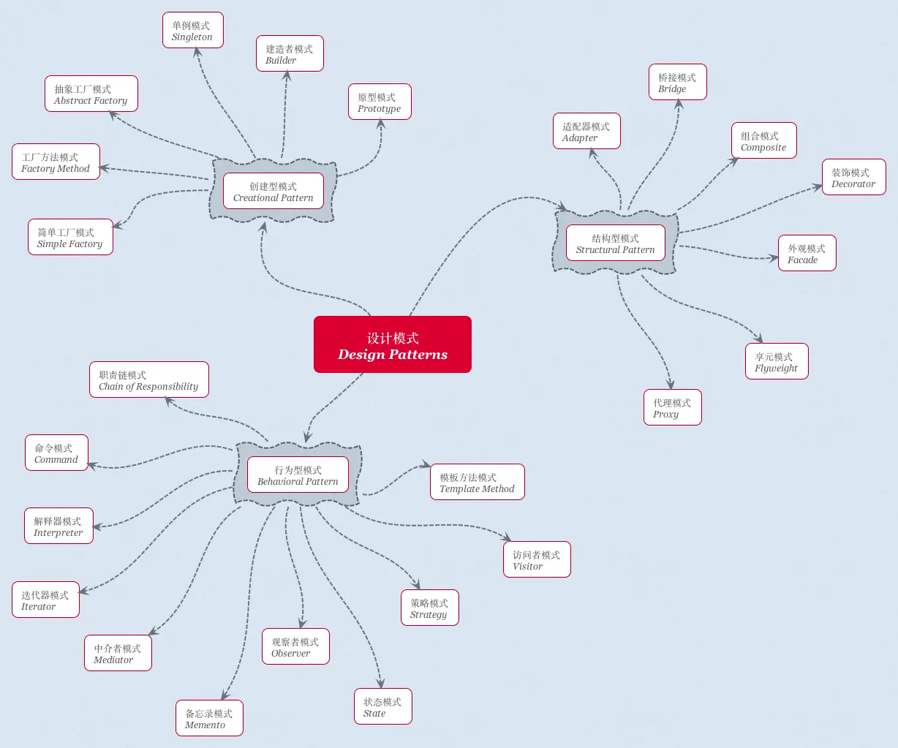

一、创建型模式（Creational Pattern）—— 6

创建型模式(Creational Pattern)对类的实例化过程进行了抽象，能够将软件模块中对象的创建和对象的使用分离。

- 简单工厂模式（Simple Factory）
- 工厂方法模式（Factory Method）
- 抽象工厂模式（Abstract Factory）
- 建造者模式（Builder）
- 单例模式（Singleton）
- 原型模式（Prototype）

二、结构型模式(Structural Pattern) —— 7

结构型模式(Structural Pattern)关注于对象的组成以及对象之间的依赖关系，描述如何将类或者对象结合在一起形成更大的结构，就像搭积木，可以通过简单积木的组合形成复杂的、功能更为强大的结构。

- 适配器模式（Adapter）
- 代理模式（Proxy）
- 桥接模式（Bridge）
- 外观模式（Facade）
- 享元模式（Flyweight）
- 组合模式（Composite）
- 装饰模式（Decorator）

三、行为型模式（Behavioral Pattern）—— 11

行为型模式(Behavioral Pattern)关注于对象的行为问题，是对在不同的对象之间划分责任和算法的抽象化；不仅仅关注类和对象的结构，而且重点关注它们之间的相互作用。

- 迭代器模式（Iterator）
- 观察者模式（Observer）
- 模板方法模式（Template Method）
- 状态模式（State）
- 命令模式（Command）
- 中介者模式（Mediator）
- 访问者模式（Visitor）
- 策略模式（Strategy）
- 解释器模式（Interpreter）
- 责任链模式（Chain of Responsibility）
- 备忘录模式（Memento）
